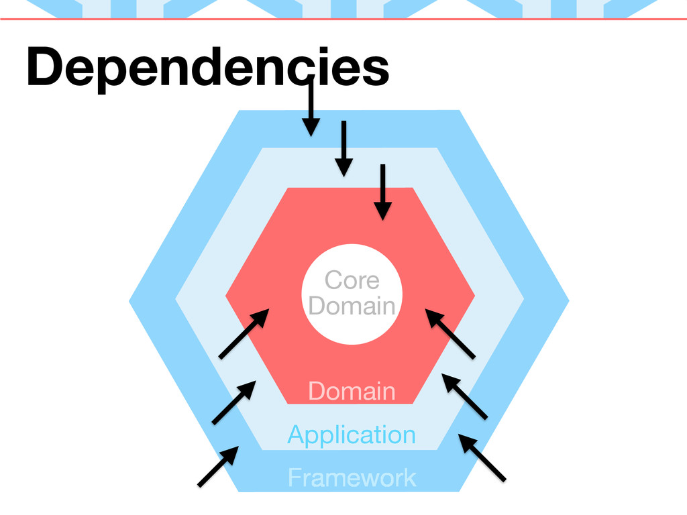
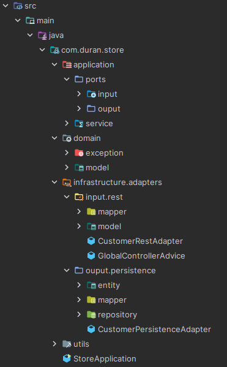

# API con Arquitectura Hexagonal en Spring Boot

## Índice

1. [Introducción](#introducción)
2. [Arquitectura](#arquitectura)
   1. [Domain](#domain)
      1. [Exception](#exception)
      2. [Model](#model)
   2. [Application](#application)
      1. [Port](#port)
         1. [Input](#input)
         2. [Output](#output)
      2. [Service](#service)
   3. [Infrastructure](#infrastructure)
      1. [Adapters](#adapters)
         1. [Input](#input-adapters)
            1. [Rest](#rest)
               1. [Mapper](#rest-mapper)
               2. [Model](#rest-model)
         2. [Output](#output-adapters)
            1. [Persistence](#persistence)
               1. [Entity](#entity)
               2. [Mapper](#persistence-mapper)
               3. [Repository](#repository)
   4. [Utils](#utils)
      1. [ErrorCatalog](#errorcatalog)
3. [Configuración](#configuración)
4. [Ejemplos de Uso](#ejemplos-de-uso)

## Introducción

Esta API está diseñada para gestionar operaciones CRUD (Crear, Leer, Actualizar y Eliminar) para la entidad Customer. La implementación sigue la arquitectura hexagonal, también conocida como arquitectura de puertos y adaptadores, utilizando el framework Spring Boot. La entidad Customer se representa a través de la clase CustomerEntity, la cual contiene los siguientes atributos: idCustomer, firstname, lastname y email.

La API ofrece los siguientes servicios a través de la interfaz CustomerServicePort:

    getCustomerById(Long idCustomer): Obtiene un cliente por su ID.
    getCustomers(): Obtiene una lista de todos los clientes.
    saveCustomer(Customer customer): Guarda un nuevo cliente.
    updateCustomer(Long idCustomer, Customer customer): Actualiza un cliente existente.
    deleteCustomerById(Long idCustomer): Elimina un cliente por su ID.

La estructura del proyecto se organiza en varios paquetes, alineados con los principios de la arquitectura hexagonal:

    domain: Contiene las excepciones y modelos de dominio.
    application: Define los puertos y servicios de aplicación.
    infrastructure: Implementa los adaptadores de entrada y salida, incluyendo la persistencia.
    utils: Proporciona utilidades como el catálogo de errores.

Esta API permite realizar operaciones con los clientes de manera eficiente y organizada, facilitando la integración y la mantenibilidad del código.
## Arquitectura

## Arquitectura

La API sigue la arquitectura hexagonal, la cual se centra en la separación de las preocupaciones y promueve una estructura modular y mantenible.



1. **Domain**: Contiene la lógica de negocio pura.
2. **Application**: Define los puertos y servicios de aplicación.
3. **Infrastructure**: Implementa los adaptadores de entrada y salida.

Esta estructura facilita la evolución y escalabilidad del proyecto, permitiendo cambiar tecnologías externas sin afectar la lógica del dominio.




### Domain

#### Exception

Capa de Excepciones en el Dominio
Propósito de la Capa de Excepciones

La capa de excepciones en el dominio tiene como objetivo:

1. **Manejo Consistente de Errores:** Proveer una manera uniforme y controlada de manejar errores y situaciones excepcionales que pueden surgir durante la ejecución de la lógica de negocio.
2. **Claridad y Mantenimiento:** Facilitar el entendimiento y mantenimiento del código al definir claramente las situaciones excepcionales que pueden ocurrir.
3. **Separación de Preocupaciones:** Mantener la lógica de manejo de errores separada de la lógica de negocio principal.

#### Model

La carpeta model del dominio contiene las clases de modelo que representan la lógica de negocio y los datos de tu aplicación. Estas clases son los "POJOs" (Plain Old Java Objects), que son objetos simples sin dependencias adicionales, excepto por algunas anotaciones de Lombok para simplificar el código.

### Application

#### Port

##### Input

Los puertos de entrada definen las operaciones que pueden realizarse sobre el dominio desde el exterior. Estos puertos representan los casos de uso y están implementados por los servicios de aplicación.

##### Output

Los puertos de salida definen las interfaces para interactuar con el mundo exterior, como bases de datos, servicios externos, etc. Estos puertos permiten que el dominio y la aplicación permanezcan independientes de los detalles de infraestructura.

#### Service

El componente CustomerService en la capa de aplicación es una implementación del puerto de entrada CustomerServicePort y hace uso del puerto de salida CustomerPersistencePort. Este servicio maneja la lógica de los casos de uso relacionados con los clientes, coordinando las operaciones del dominio y la infraestructura.

### Infrastructure

#### Adapters

##### Input

###### Rest

Estos controladores manejan las solicitudes HTTP y delegan las operaciones a los servicios correspondientes. En este caso, tenemos dos controladores: uno para gestionar las operaciones CRUD relacionadas con los customer y otro para gestionar las excepciones globales.


###### Rest Mapper

Este mapper utiliza MapStruct para convertir entre objetos de dominio y entidades de persistencia. MapStruct es un marco que genera automáticamente la implementación de los mapeos a partir de las definiciones de la interfaz.

###### Rest Model

**Paquete request**

Este paquete contiene las clases que representan las solicitudes recibidas por la API REST. Estas clases se utilizan para validar y transferir datos desde las solicitudes HTTP a la lógica de la aplicación.

**Paquete response**

Este paquete contiene las clases que representan las respuestas enviadas por la API REST. Estas clases se utilizan para estructurar y transferir datos desde la aplicación a las respuestas HTTP.
##### Output

###### Persistence

El paquete output->persistence en la arquitectura hexagonal se encarga de la interacción con la base de datos. Este paquete contiene adaptadores que implementan los puertos de salida definidos en la capa de aplicación, así como las interfaces de repositorio que utilizan frameworks como Spring Data JPA para realizar operaciones CRUD.

###### Entity

Esta clase se utiliza para mapear los registros de la tabla de base de datos customers a objetos Java.

###### Persistence Mapper

El paquete output->persistence->mapper contiene los mapeadores que se utilizan para convertir entre los modelos de dominio (Customer) y las entidades de persistencia (CustomerEntity). Estos mapeadores juegan un papel crucial en la capa de persistencia para asegurar que los datos se puedan convertir fácilmente entre las representaciones utilizadas en la lógica de negocio y las almacenadas en la base de datos.

###### Repository

El repositorio CustomerRepository se encuentra en el paquete output->persistence->repository y es una interfaz que extiende JpaRepository. Esta interfaz define métodos estándar para realizar operaciones CRUD (Crear, Leer, Actualizar, Eliminar) sobre entidades de tipo CustomerEntity. Este tipo de repositorio es típicamente utilizado en aplicaciones que hacen uso de Spring Data JPA para la persistencia de datos.

### Utils

#### ErrorCatalog

El enum ErrorCatalog se encuentra en el paquete utils y define un catálogo de códigos y mensajes de error estáticos utilizados en la aplicación. Este enfoque es útil para estandarizar y centralizar la gestión de errores en la aplicación, proporcionando códigos de error específicos y mensajes descriptivos para diferentes situaciones de error que pueden ocurrir durante la ejecución.

## Configuración

Para ejecutar esta aplicación, asegúrate de tener configurado lo siguiente:

1. **Java 21:** Esta aplicación requiere Java 21. Asegúrate de que esté instalado y configurado correctamente en tu sistema.

2. **Configuración del entorno de desarrollo:**

    **IDE:** Utiliza un IDE como IntelliJ IDEA, Eclipse o VSCode con soporte para proyectos Spring Boot.

    **Maven:** Asegúrate de tener Maven instalado y configurado si estás utilizando uno de estos para la gestión de dependencias.

3. **Dependencias de la aplicación:**

    Las dependencias de la aplicación se gestionan a través de Maven. Asegúrate de actualizar tu pom.xml para incluir cualquier dependencia adicional que necesites.

## Ejemplos de Uso

Este comando `curl` se utiliza para enviar una solicitud GET al servidor local (`localhost`) en el puerto 8090, solicitando la lista de customers disponibles en la ruta /customer/customers.

```bash
curl --location --request GET 'localhost:8090/customer/customers'
```
Este comando `curl` realiza una solicitud HTTP GET al servidor local (`localhost`) en el puerto 8090 para obtener información del cliente con ID 10. 

```bash
curl --location --request GET 'localhost:8090/customer/10'
```

Este comando `curl` realiza una solicitud HTTP POST al servidor local (`localhost`) en el puerto 8090 para crear un nuevo customer.

```bash
curl --location --request POST 'localhost:8090/customer' \
--header 'Content-Type: application/json' \
--data-raw '{
    "firstname": "Doe",
    "lastname": "John",
    "email": "hannah.rodriguez10@example.com"
}'
```

Este comando `curl` realiza una solicitud HTTP PUT al servidor local (`localhost`) en el puerto 8090 para actualizar la información del customer con ID 10.

```bash
curl --location --request PUT 'localhost:8090/customer/10' \
--header 'Content-Type: application/json' \
--data-raw '{
    "firstname": "Hannah",
    "lastname": "Rodriguez",
    "email": "hannah.rodriguez10@example.com"
}'
```

Este comando `curl` realiza una solicitud HTTP DELETE al servidor local (`localhost`) en el puerto 8090 para eliminar la información del customer con ID 10.

```bash
curl --location --request DELETE 'localhost:8090/customer/10' \
--data-raw ''
```